This page builds one working automation end to end: an inbound WhatsApp
message creates a task named `Write back to <contact>`, linked to that
contact.

It uses [`n8n-nodes-alphone`](https://www.npmjs.com/package/n8n-nodes-alphone),
the community node for AlphOne. For the engine neutral view, and for
driving AlphOne from any other engine with plain HTTP, see the
[automation guide](/guides/automation/).

:::note[AlphOne does not include an engine]
AlphOne neither bundles nor redistributes n8n, and the released image
contains only AlphOne itself. You run n8n yourself, under its own
licence, and point it at the API.
:::

## What you need

- An n8n instance you administer, self hosted or cloud
- An AlphOne instance n8n can reach over HTTP
- An AlphOne login, to mint a token

## 1. Install the node

In n8n, open **Settings** then **Community nodes** then **Install**, and
enter `n8n-nodes-alphone`. Only Owner and Admin accounts may install
community nodes.

Two nodes appear afterwards. **AlphOne** performs actions, and **AlphOne
Trigger** starts a workflow when something happens.

Self hosted instances need community packages enabled, which is the
default. If installation is refused, set
`N8N_COMMUNITY_PACKAGES_ENABLED=true` and, until the node passes n8n
verification, `N8N_UNVERIFIED_PACKAGES_ENABLED=true`.

## 2. Mint an API token

An engine cannot hold a browser session, so it authenticates with a
token. On the AlphOne host:

```sh
alphone token create -email you@example.com -name "n8n"
```

The secret prints once and is stored only as a hash. Copy it now,
because it cannot be recovered, only replaced.

A token acts as the user who created it, so create it against the
account whose work the automation should own. Disabling that user stops
their tokens the way it already stops their sessions.

## 3. Create the credential

Open the **Credentials** tab and press **Create credential**.

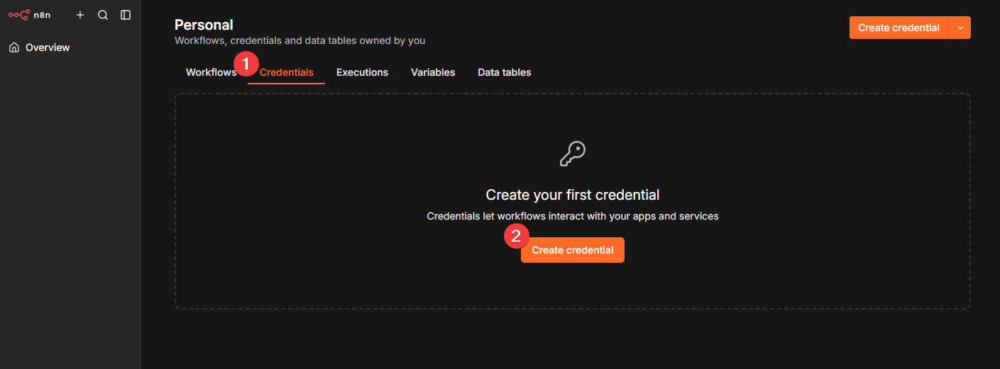

Search for **AlphOne API** and select it.

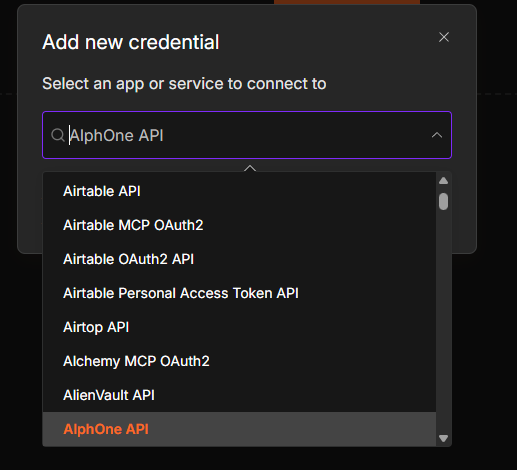

Fill in two fields and save.

| Field | Value |
| ----- | ----- |
| Base URL | where n8n reaches AlphOne, with no trailing slash |
| API Token | the secret from step 2 |

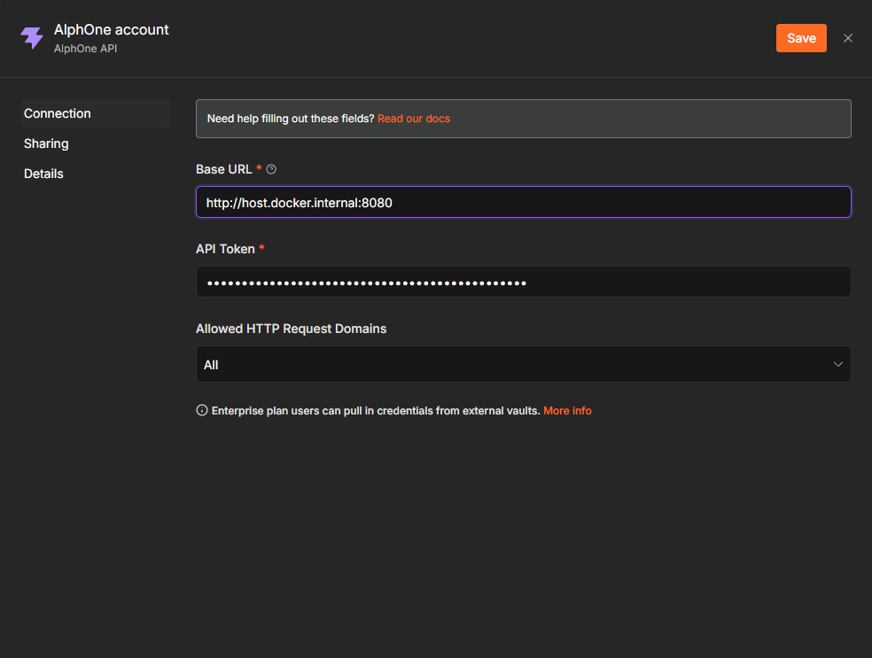

The base URL depends on where each side runs:

| AlphOne runs | Base URL from inside n8n |
| ------------ | ------------------------ |
| On your machine, n8n in Docker | `http://host.docker.internal:8080` |
| Both in the same compose project | `http://alphone:8080` |
| A deployed instance | its public URL |

`localhost` inside a container means the container itself, never your
machine, so it will not reach AlphOne.

Press the test button. It calls `GET /api/version`, which needs a valid
credential, so a success there proves the whole connection.

## 4. Start a workflow

Open the **Workflows** tab and press **Create workflow**.

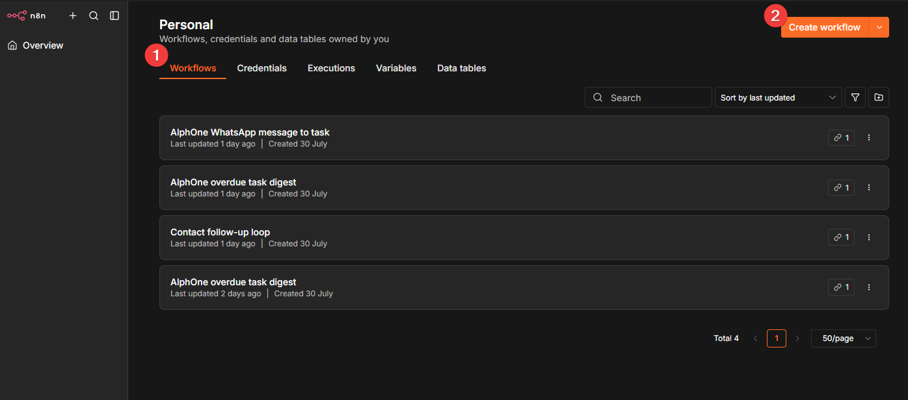

Press **Add first step** and search for `alphone`.

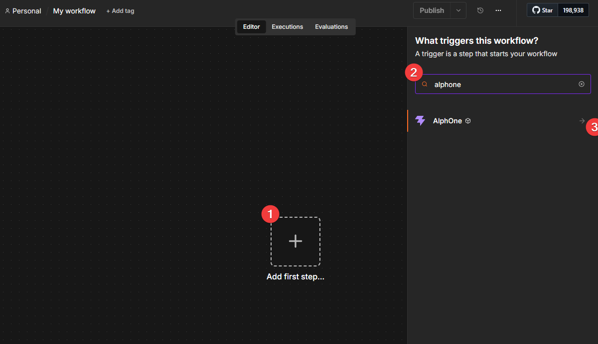

The node offers a trigger for each event it supports.

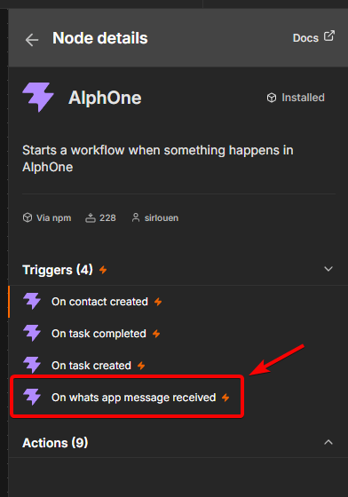

Choose **On whats app message received**.

## 5. Configure and test the trigger

Pick the credential from step 3, and confirm the event reads **WhatsApp
Message Received**.

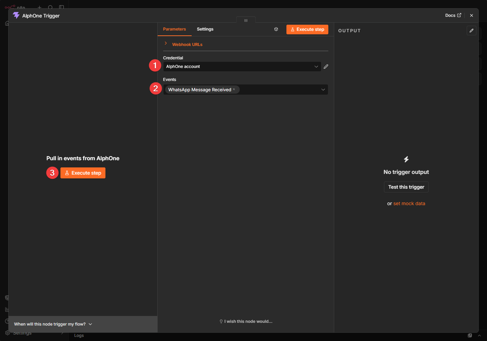

Press **Execute step**. n8n waits for a real event.

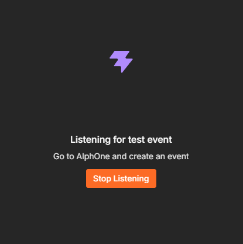

While it listens, send a WhatsApp message to your connected number. The
envelope arrives:

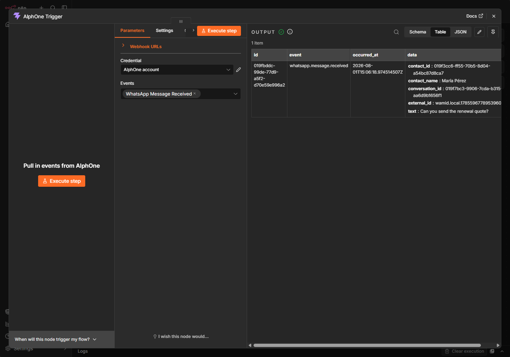

Every delivery carries the same four fields. `id` names the event and
stays the same across retries, so store it if you need to drop
duplicates. `data` carries the subject, and for `whatsapp.message.received`
that means `conversation_id`, `contact_id`, `contact_name`,
`external_id`, and `text`. The [webhooks
reference](/reference/webhooks/) documents the envelope in full.

Testing this way needs no published workflow, which makes it the fastest
way to see real data before building the rest.

## 6. Create the task

Press the **+** after the trigger. The node offers nine actions across
tasks and contacts.

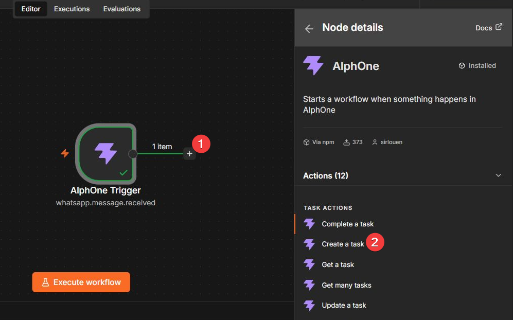

Choose **Create a task** and set:

| Field | Value |
| ----- | ----- |
| Resource | `Task` |
| Operation | `Create` |
| Title | `Write back to {{ $json.data.contact_name }}` |
| Due On | leave the default |

Then **Add Field** under **Additional Fields**:

| Field | Value |
| ----- | ----- |
| Contact ID | `{{ $json.data.contact_id }}` |

Switch each of those to expression mode with its `fx` toggle, then type
the value without a leading `=`. n8n adds that prefix itself when it
stores the parameter, so typing one leaves a stray `=` in the value and
AlphOne answers 400. The small preview under each field shows the
resolved value, so check it reads `Write back to Maria Perez` and a bare
uuid before running.

Press **Execute step**.

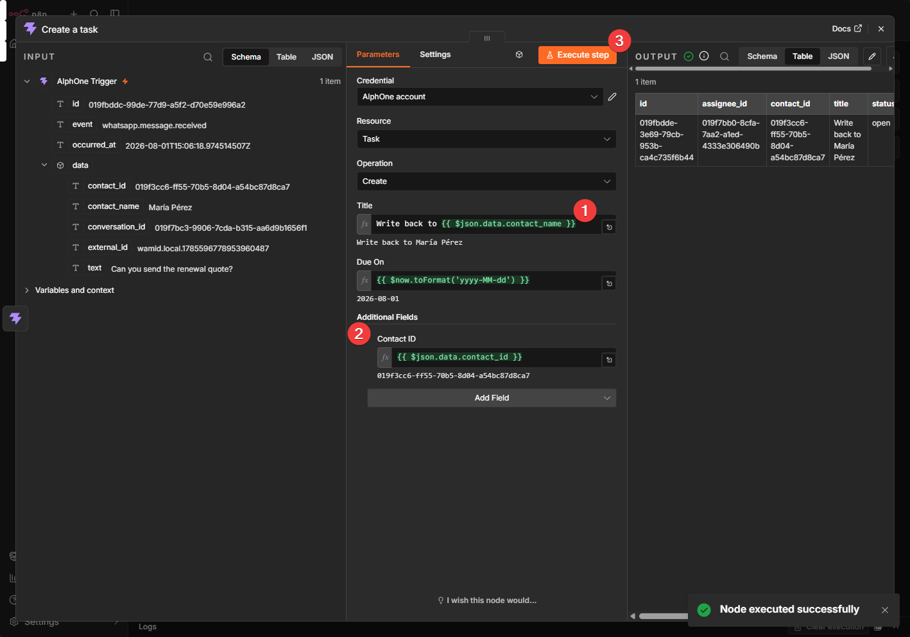

The task exists in AlphOne now, linked to the contact who wrote in.

## 7. Publish

Name the workflow and press **Publish**.

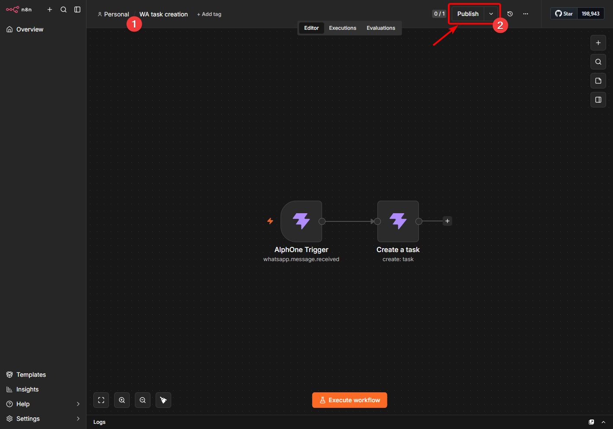

Publishing is what registers the webhook. The trigger calls
`POST /api/webhooks` on AlphOne and stores the subscription id and its
signing secret in workflow static data. An unpublished trigger has no
subscription, so nothing is delivered to it.

Confirm AlphOne agrees, using the token from step 2:

```sh
curl -s -H "Authorization: Bearer $TOKEN" https://your-domain/api/webhooks
```

A subscription pointing at your n8n webhook url means the loop is live.
From now on, every inbound WhatsApp message creates its task on its own.

## How AlphOne marks automated work

A task created with an API token records `token:<name>` in its
`origin_source`, so work an automation created stays distinguishable
from work a person typed. Attribution comes from the credential rather
than the request, so a workflow cannot claim to be someone else, and it
needs nothing from you.

## Deliveries and retries

AlphOne signs every delivery with HMAC-SHA256 over the exact bytes sent,
and the node verifies that signature before running the workflow, so a
forged request is rejected. Delivery is at least once, retried with a
widening wait for 24 hours, so a workflow that survives a restart
catches up on its own. Answer quickly, because AlphOne waits 10 seconds.

To see what happened from the AlphOne side, read the delivery queue:

```sh
docker compose exec postgres psql -U postgres -d alphone -c \
  "SELECT event_name, status, attempts, last_error
     FROM core.webhook_deliveries ORDER BY created_at DESC LIMIT 5"
```

`delivered` with `attempts = 1` means the chain worked first time.

## When it does not work

| Symptom | Cause |
| ------- | ----- |
| The credential test fails | The base URL has a trailing slash, or says `localhost` where the container cannot reach AlphOne |
| `invalid token` | The token id was pasted instead of the secret. Only the value starting `a1_` authenticates |
| Nothing arrives after publishing | No subscription exists. Check `GET /api/webhooks` and republish |
| A task titled with literal `{{ }}` | The field is not in expression mode. Use its `fx` toggle |
| The task node answers 400, previews show a leading `=` | An `=` was typed into the expression editor. n8n adds it, so delete yours |
| Deliveries stuck `pending` with `subscriber answered 404` | A subscription outlived its workflow. Delete it with `DELETE /api/webhooks/{id}` |

## Beyond this workflow

The same two nodes cover the other three events, `task.created`,
`task.completed`, and `contact.created`, and nine actions across tasks
and contacts. A schedule trigger with **Get many tasks** filtered by
`due_before` makes a morning digest of overdue work, with no trigger
registration involved.
