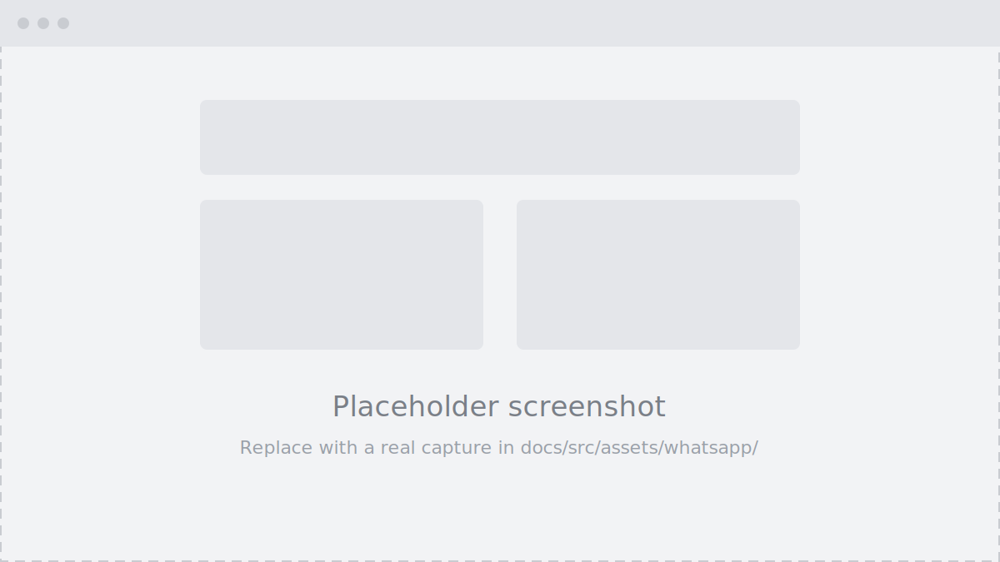

<!--
  Demo page
-->

Connecting AlphOne to WhatsApp takes one Meta app and four values. By the
end of this guide you will have filled in every `ALPHONE_WHATSAPP_*`
variable from [Configuration](/self-hosting/configuration/) and received
your first message in the CRM inbox.

You need:

- a [Meta developer account](https://developers.facebook.com/)
- your AlphOne instance reachable over HTTPS (Meta refuses plain-HTTP
  webhooks)
- a phone number for the business line

## 1. Create the Meta app

<!-- TODO: write this section. The paragraph and figure below are an
     EXAMPLE of the text + screenshot pattern, replace them with the
     real steps. -->

Go to [developers.facebook.com/apps](https://developers.facebook.com/apps)
and create a new app of type **Business**. The name is only visible to
you. Once it is created you land on the app dashboard, where every later
step in this guide starts:

## 2. Add the WhatsApp product

<!-- TODO: adding WhatsApp to the app, picking or creating the business
     portfolio, what the test number gives you. -->

## 3. Collect the credentials

<!-- TODO: where to find each value and which env var it fills:
     - access token        -> ALPHONE_WHATSAPP_ACCESS_TOKEN
     - app secret          -> ALPHONE_WHATSAPP_APP_SECRET
     - phone number ID     -> ALPHONE_WHATSAPP_PHONE_NUMBER_ID
     Note the temporary token expires every 24 hours; cover the
     permanent token path. -->

## 4. Configure the webhook

<!-- TODO: webhook URL is https://<your-domain>/api/plugins/whatsapp/webhook,
     the verify token is invented by you and pasted on both sides
     (ALPHONE_WHATSAPP_VERIFY_TOKEN), and the app must subscribe to the
     "messages" webhook field or nothing arrives. -->

## 5. Send the first message

<!-- TODO: sending a test message to the business number and seeing the
     conversation appear live in AlphOne. -->
