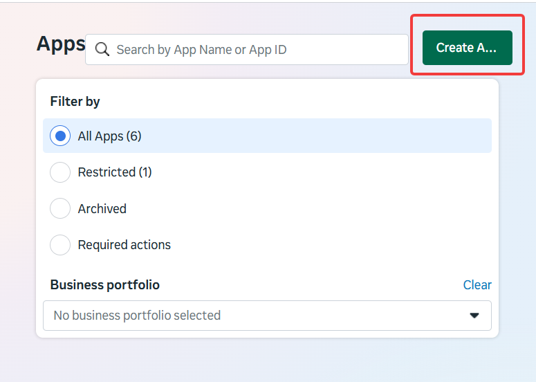
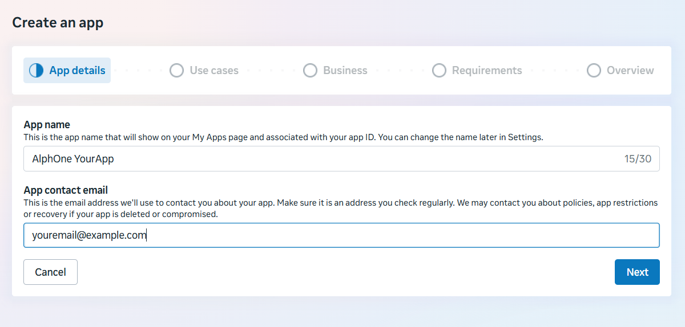
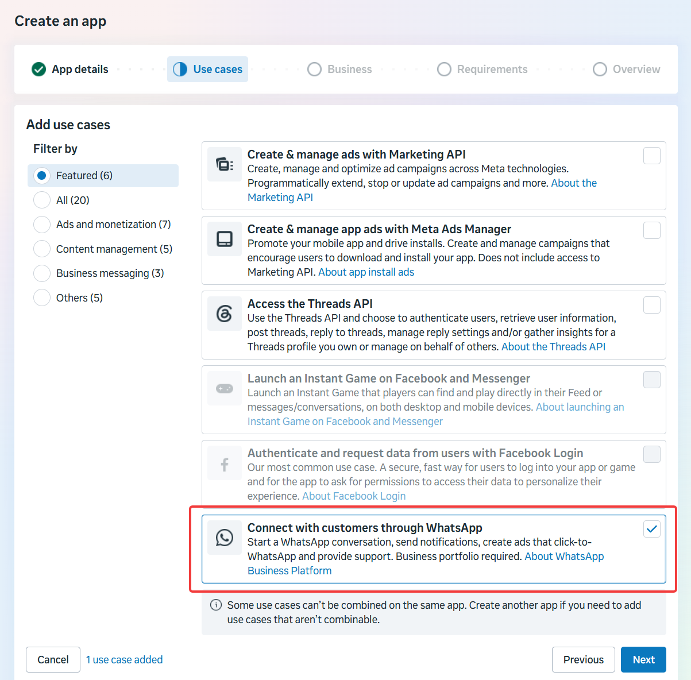
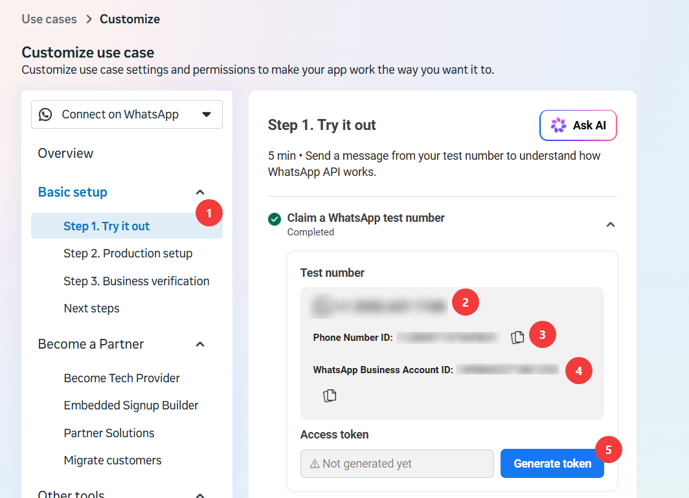
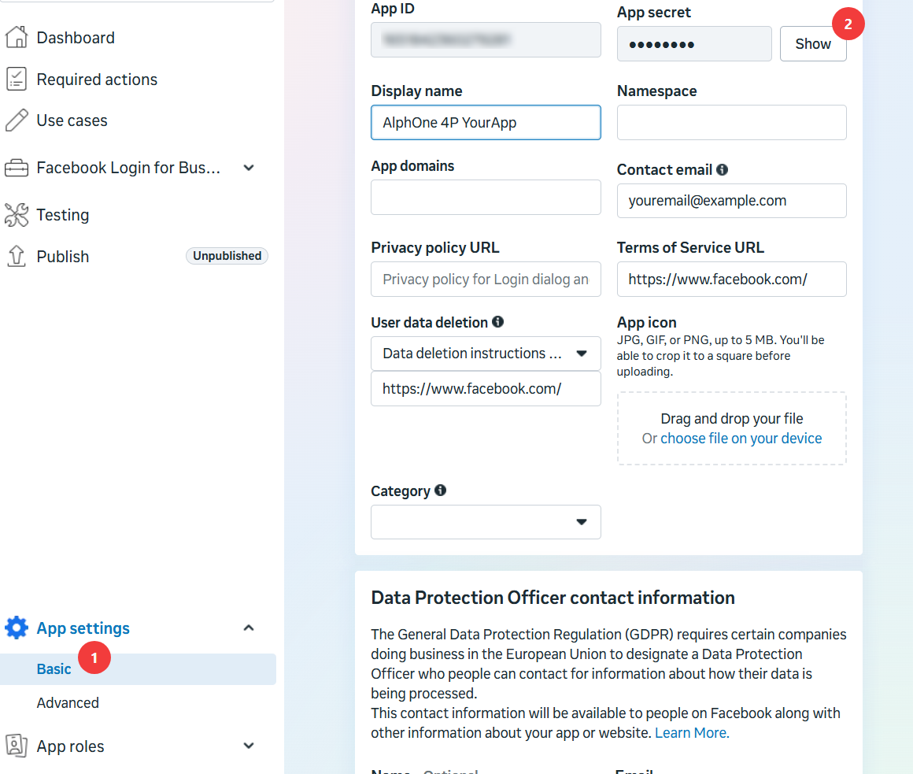
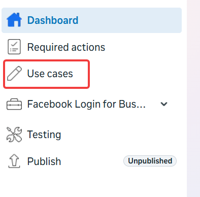
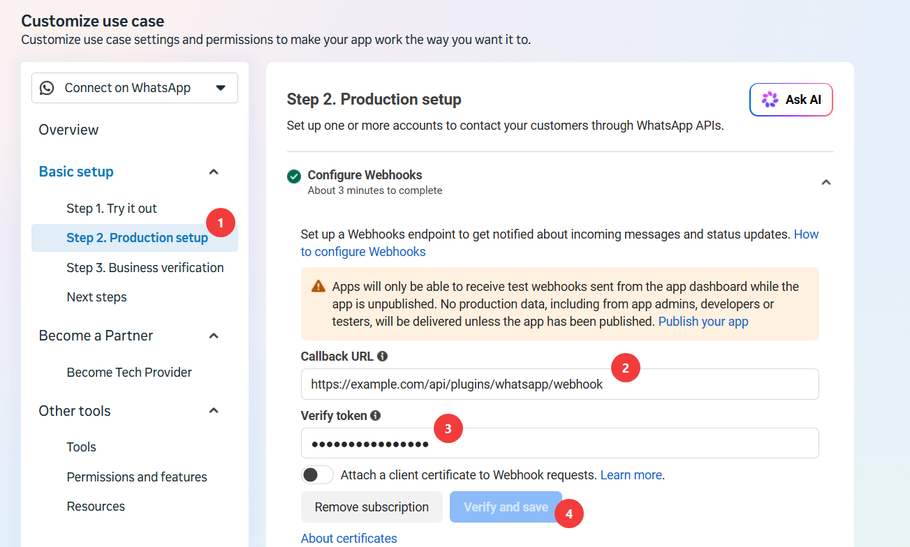
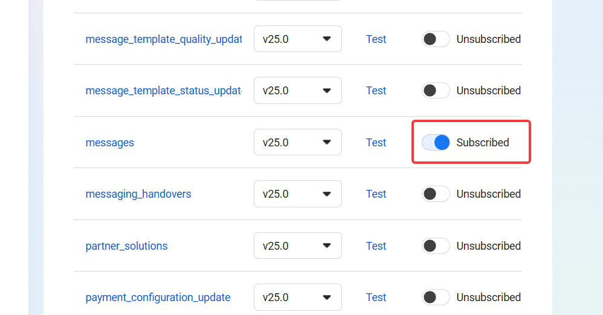
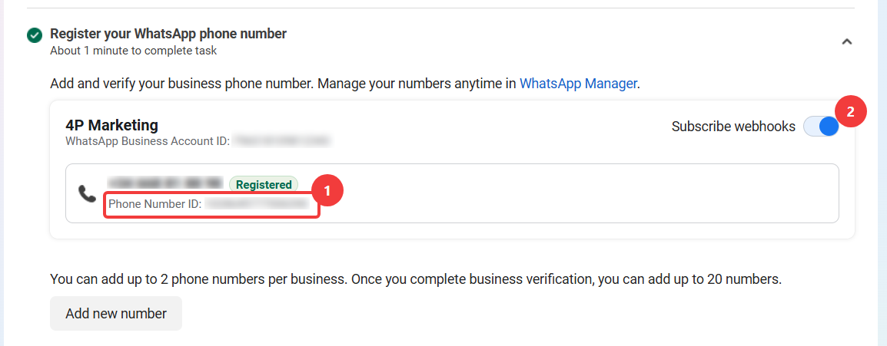
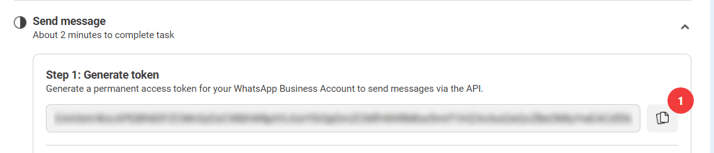

Connecting AlphOne to WhatsApp takes one Meta app and four values. By the
end of this guide you will have filled in every `ALPHONE_WHATSAPP_*`
variable from [Configuration](/self-hosting/configuration/) and received
your first message in the CRM inbox.

You need:

- a [Meta developer account](https://developers.facebook.com/)
- your AlphOne instance reachable over HTTPS (Meta refuses plain-HTTP
  webhooks)
- a phone number for the business line, one that is **not** already
  registered on the consumer WhatsApp app

## 1. Create the Meta app

Go to
[developers.facebook.com/apps](https://developers.facebook.com/apps) and
press **Create App**:



The wizard starts with **App details**. The name is internal, pick
anything that identifies the deployment:



On the **Use cases** step, select **Connect with customers through
WhatsApp**:



The use case requires a business portfolio. On the **Business** step,
pick an existing portfolio or let the wizard create one, then continue
through **Requirements** and **Overview** to finish.

## 2. Try it out with the test number

After creation Meta drops you into the use case customization, on
**Basic setup → Step 1. Try it out** (1). Meta claims a free test number
for you:



Two of the four values AlphOne needs are already on this screen:

- **Phone Number ID** (3) is `ALPHONE_WHATSAPP_PHONE_NUMBER_ID`. Copy
  the ID, not the phone number itself (2).
- **Generate token** (5) produces `ALPHONE_WHATSAPP_ACCESS_TOKEN`.

The WhatsApp Business Account ID (4) is not used by AlphOne.

:::caution[Test tokens die within 24 hours]
The token generated here is temporary. Roughly a day later the Graph API
starts answering error 190 and sending silently stops working. That is
fine for a first try, but switch to the permanent token from
[step 5](#5-go-to-production) for anything that should keep running.
The test number can also only message up to five recipient phone
numbers that you register on this same screen.
:::

## 3. Copy the app secret

AlphOne checks the signature Meta attaches to every webhook delivery,
which needs the app secret. Go to **App settings → Basic** (1), press
**Show** on the App secret field (2), and keep the value for
`ALPHONE_WHATSAPP_APP_SECRET`:



## 4. Configure the webhook

:::note[Order matters here]
Meta verifies the webhook the moment you save it, by calling your
endpoint with a challenge. AlphOne only answers that challenge when it
is already running with your `ALPHONE_WHATSAPP_VERIFY_TOKEN` set. So:
invent the verify token, put it in AlphOne's `.env`, restart AlphOne,
and only then press **Verify and save**.
:::

To get back to this screen later, open **Use cases** in the sidebar and
choose **Customize**:



Under **Step 2. Production setup** (1), open **Configure Webhooks**. Set
the Callback URL to your instance's webhook endpoint (2) and paste the
verify token you invented (3), then press **Verify and save** (4):



The Callback URL is always:

```text
https://your-domain/api/plugins/whatsapp/webhook
```

Verification alone delivers nothing yet. In the webhook fields table
below, subscribe to the **messages** field, the only one AlphOne needs:



At this point, you can try to send a message to the test number from your phone.
It should appear in AlphOne's inbox live. You may need to reload your Alphone
instance if you just added the webhook values to the `.env` and restarted it.

## 5. Go to production

The test number is a sandbox. For the real business line, register your
own number under **Step 2. Production setup → Register your WhatsApp
phone number**. Once it shows **Registered**, copy its **Phone Number
ID** (1), which replaces the test one in
`ALPHONE_WHATSAPP_PHONE_NUMBER_ID`, and make sure **Subscribe
webhooks** is on for the number (2):



Then, under **Send message**, generate the **permanent** access token
for the business account and copy it (1) into
`ALPHONE_WHATSAPP_ACCESS_TOKEN`:



Unlike the test token, this one does not expire on its own.

## 6. Fill in AlphOne and restart

The four values, side by side:

| Variable | Where it came from |
| --- | --- |
| `ALPHONE_WHATSAPP_VERIFY_TOKEN` | Invented by you in step 4, pasted on both sides. |
| `ALPHONE_WHATSAPP_APP_SECRET` | App settings → Basic → App secret (step 3). |
| `ALPHONE_WHATSAPP_ACCESS_TOKEN` | The permanent token (step 5), or the 24-hour test token (step 2). |
| `ALPHONE_WHATSAPP_PHONE_NUMBER_ID` | The production number's ID (step 5), or the test number's (step 2). |

Put them in the `.env` of your [self-hosted
install](/self-hosting/install/) and recreate the container:

```sh
cd /srv/alphone
docker compose up -d
```

For [local development](/start/local-development/), put them in the
repository's `.env` and restart `go run ./cmd/alphone`.

## 7. Send the first message

Send a WhatsApp message from your phone to the business number. The
conversation appears in AlphOne's inbox live, without a reload, and you
can answer it from there.

If it does not:

- **Webhook verification failed** in step 4: AlphOne was not running,
  not reachable over HTTPS, or the verify token in `.env` does not
  match. Fix, restart AlphOne, and press Verify and save again.
- **Messages never arrive**: check the **messages** field subscription
  (step 4), the number's **Subscribe webhooks** toggle (step 5), and
  whether the app is published.
- **Sending fails after a day**: the Graph API returns error 190, which
  means the temporary test token expired. Generate the permanent token
  from step 5 or regenerate a new test token from step 2 and replace it in `.env`.
